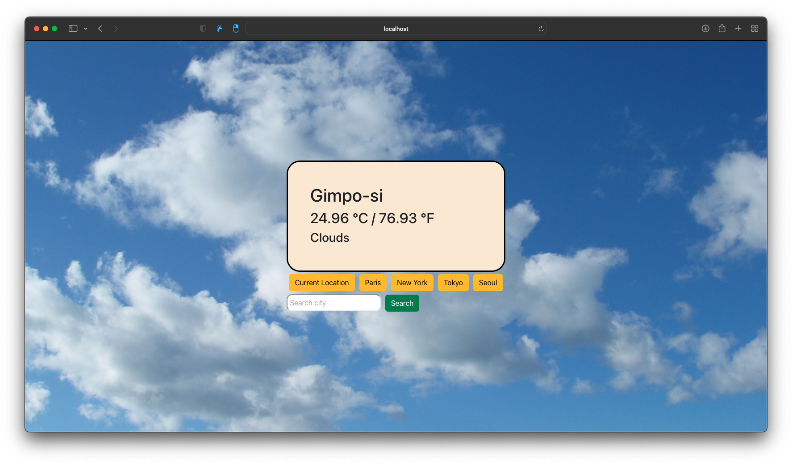
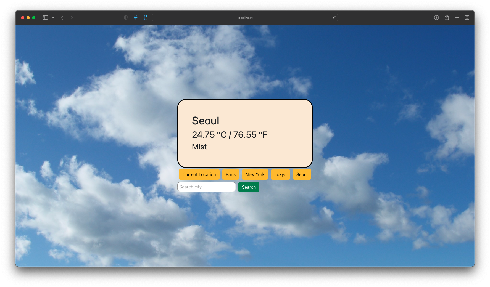
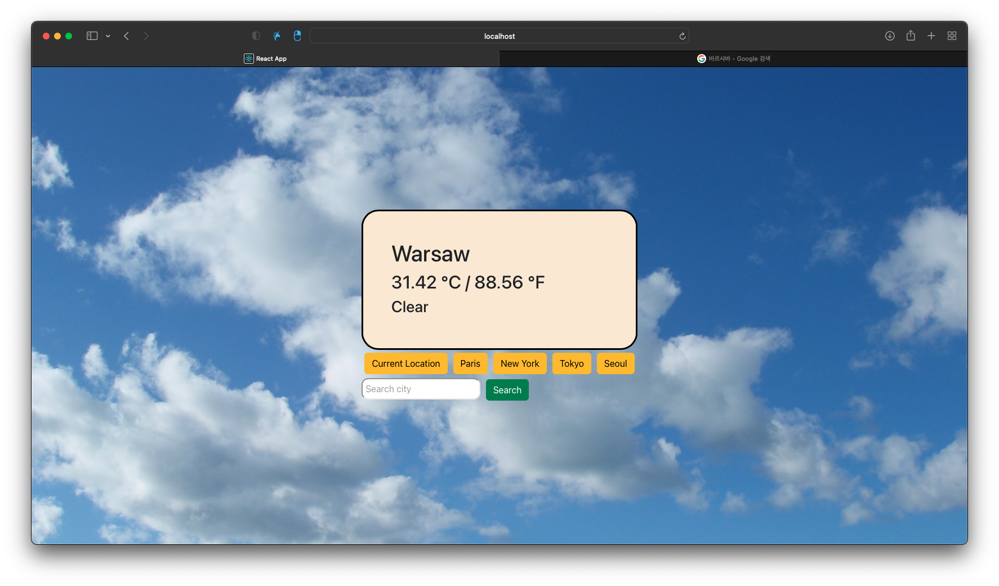

<h1>React_Weather_api</h1>

<h3>you can see Your current location weather, temperature</h3>
<h3>You can also find out the weather in the city you want to know.</h3>  
<h3>Current Location</h3> 

<h3>Seoul Button</h3>

<h3>Search</h3>

